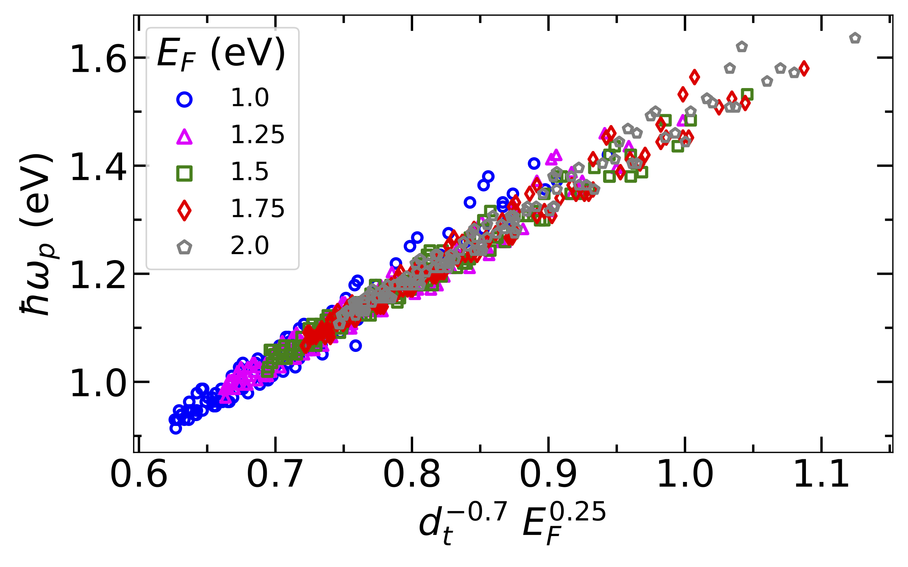

# cntabsorpt
Calculation of intersubband plasmons in doped carbon nanotubes.

We theoretically investigate intersubband plasmon excitations in doped single wall carbon 
nanotubes (SWNTs) by examining the dependence of plasmon frequency on the nanotube diameter, 
chirality, and Fermi energy. The intersubband plasmons can be excited by light with polarization 
perpendicular to the nanotube axis and thus the plasmon excitations corresponds to optical 
transitions between the two different subbands, which are sensitive to the Fermi energy. 
In every SWNT, this mechanism leads to the emergence of the optical absorption peak at the 
plasmon frequency for a given Fermi energy, E_F. The plasmon frequencies calculated for many 
SWNTs with diameter d < 2 nm exhibit a dependence on (1/d)^(-0.7) and the frequencies are further 
affected by Fermi energy as E_F^0.25. With this knowledge, it is possible to develop a map of 
intersubband plasmon excitations in doped SWNTs that could be useful to quickly estimate the 
doping level and also be an alternative way to characterize nanotube chirality.

If you use this code for your research, please, cite this:
https://arxiv.org/abs/1811.11451

In this code you can calculate:
1. Energy bands for any chirality (n,m) if tube diameter is smaller than 2 nm.
2. Complex dielectric permittivity function.
3. Optical absorption (interband and intraband).
4. DOS and joint DOS

The main input of the program is tube.param.** file, where ** stands for n amd m numbers.\
The structure of the input file is the following:

**300.0**-----------------------Temperature\
**10** **5**------------------------n m\
**100**-------------------------number of k points\
**0.0**-------------------------doping (n-p) per length (1/A)\
**0.0**-------------------------Fermi level (eV)\
**1.3**-------------------------refractive index\
**1.0**-------------------------background dielectric permittivity\
**501**-------------------------number of laser photon energies\
**0.0** **4.0**---------------------Laser photon energy range (eV)\
**0.05**------------------------Laser linewidth (eV)\
**501**  **-0.7**  **0.7**----------------number of electron DOS energies, electron DOS energy range (eV)\
**0.0**-------------------------polarization angle

For any further questions do not hesitate to contact me: dasha.shatco@gmail.com

